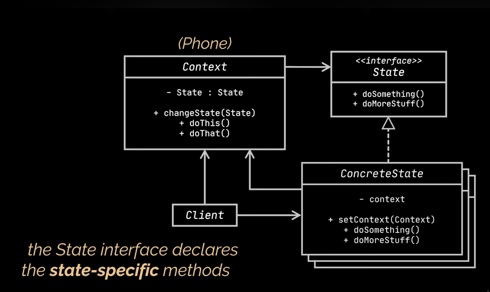
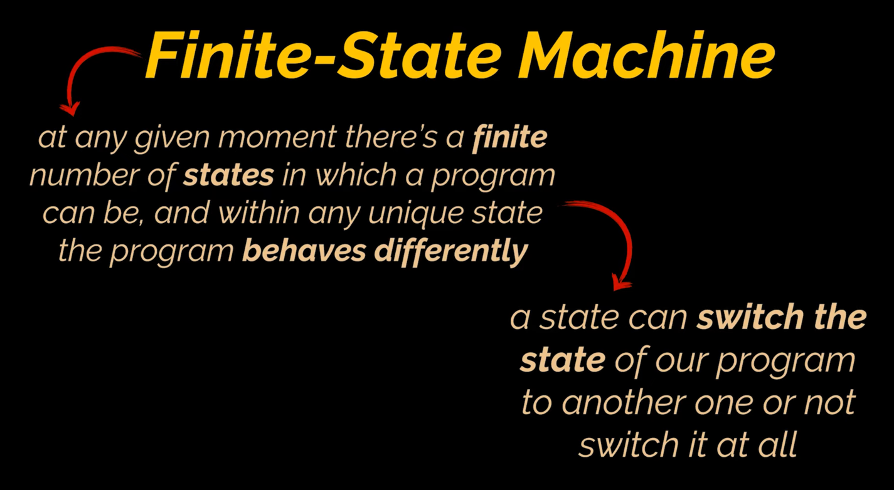
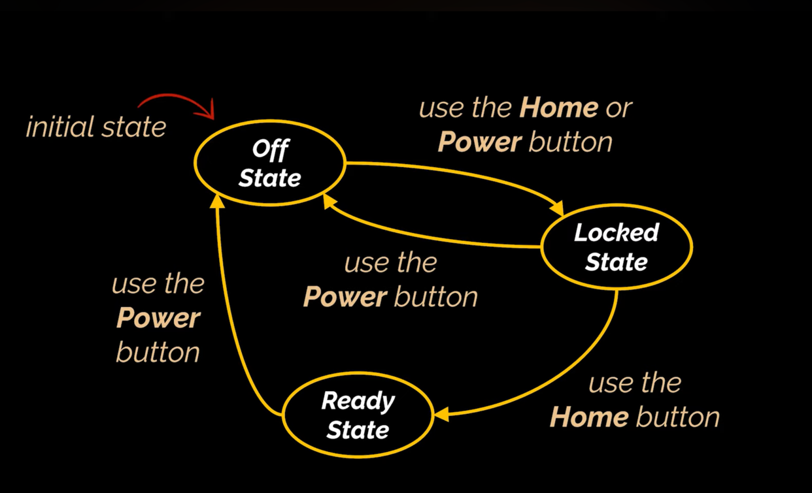
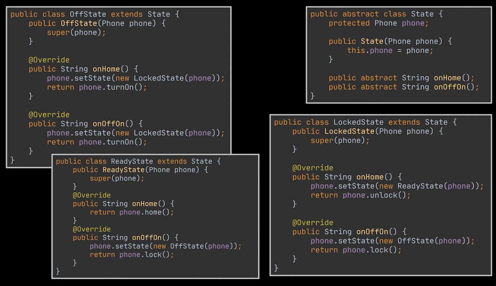
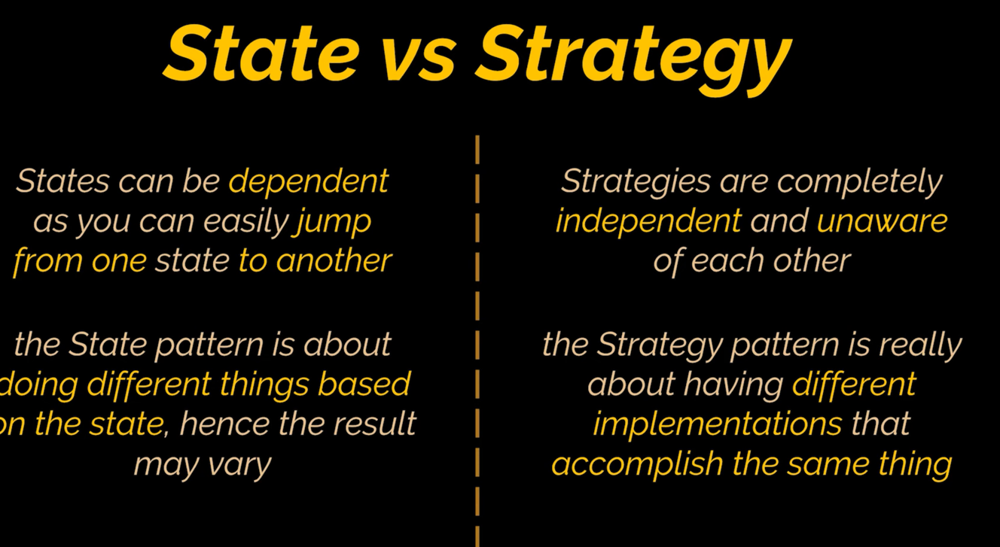

# State Design Pattern

#### Lets consider a smartphone and suppose our phone can be in 3 different states

### Here comes State design pattern
- lets object alter its behaviour when its internal state changes

### What is the object that changes State
- in this case, it is the phone
- phone class has the state of the object along with functionalities that it can perform

### One class for each state extending the abstract state class
Now each state class has to override the abstract methods and implement the actual things like
- jumping to another state
- declares the state specific methods
- invoking functionalities of the phone class

## State VS Strategy
State can be considered as an extension of Strategy as both patterns are based on composition, they change the behavior of the context by delegating some work to helper objects

