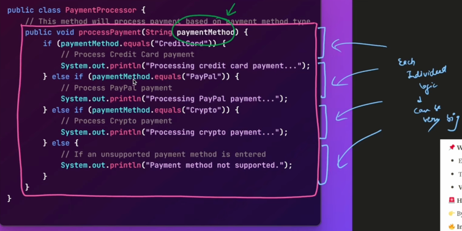

## Strategy
Users can switch between strategies based on:
   - user input
   - system requirements

### Traditional Approach : Payment Processing



 - you will have ot change the existing code even if you want to add one more payment method
 - harder to maintain, difficult to read
 - 
## How to fix?
### Slight improvement using Interfaces : PaymentProcessor class
- we define a PaymentMethod interface which will be implemented by each payment method 
- 
- allthough this makes our processPayment very less bloated, they only have to call the processPayment buit you'll add a new if else block for a new payment method

### How do we go about it then?
# 🧩 Strategy Design Pattern – Payment Example

The **Strategy Pattern** allows you to define a family of algorithms, encapsulate each one, and make them interchangeable.  
In this example, we demonstrate how different payment methods (like Credit Card, PayPal, etc.) can be implemented using this pattern.

---

## ⚙️ Create Strategy Instances

- We create different strategy objects like `CreditCardPayment`, `PayPalPayment`, etc.
- These objects implement the `PaymentStrategy` interface and provide their own implementation for `processPayment()` 💳🏦

---

## 🏗️ PaymentProcessor

- We instantiate the `PaymentProcessor` class.
- We pass a specific payment strategy (e.g., `CreditCardPayment`) to it ✅
- This ensures that the **selected payment method** is used dynamically 💡

---

## 🔄 Dynamically Change Strategies

- We can **change the payment method dynamically** using `setPaymentStrategy()`.
- **No modification** to the `PaymentProcessor` class is required! ❌🔧
- This makes our system **scalable**, **modular**, and **future-proof** 🚀✨

---

## 💻 Example Code (Optional)

```java
// PaymentStrategy Interface
public interface PaymentStrategy {
    void processPayment(double amount);
}

// Concrete Strategies
public class CreditCardPayment implements PaymentStrategy {
    public void processPayment(double amount) {
        System.out.println("Paid " + amount + " using Credit Card.");
    }
}

public class PayPalPayment implements PaymentStrategy {
    public void processPayment(double amount) {
        System.out.println("Paid " + amount + " using PayPal.");
    }
}

// Context Class
public class PaymentProcessor {
    private PaymentStrategy paymentStrategy;

    public PaymentProcessor(PaymentStrategy paymentStrategy) {
        this.paymentStrategy = paymentStrategy;
    }

    public void setPaymentStrategy(PaymentStrategy paymentStrategy) {
        this.paymentStrategy = paymentStrategy;
    }

    public void pay(double amount) {
        paymentStrategy.processPayment(amount);
    }
}

// Usage
public class Main {
    public static void main(String[] args) {
        PaymentProcessor processor = new PaymentProcessor(new CreditCardPayment());
        processor.pay(100.0);

        // Dynamically change strategy
        processor.setPaymentStrategy(new PayPalPayment());
        processor.pay(200.0);
    }
}
```
