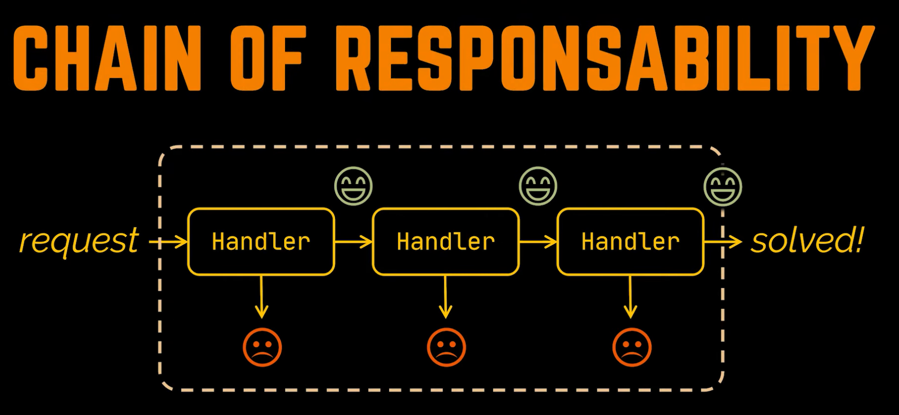
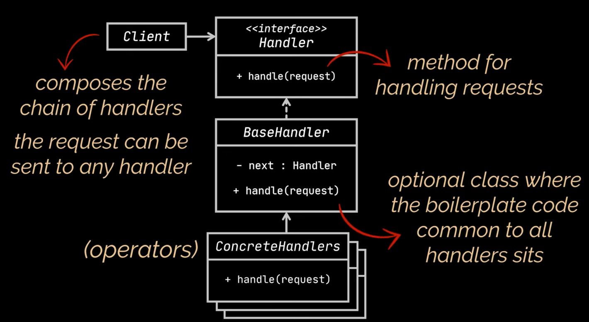

- Transforms particular behaviours into stand-alone object called handlers

Suppose you are working on an auth app, you should pass several checks 
1. Validate username first
2. Validate Password
3. Check Role, if he is admin  to grant him specific roghts and all

- Handler class will store a reference to the next handler in the chain 
- Allows us to declare a method that will assign this reference like a setter for the next handler
- concrete handlers will implement tha abstarcty handle method
- One more method will be there which forwards the request to the next object

