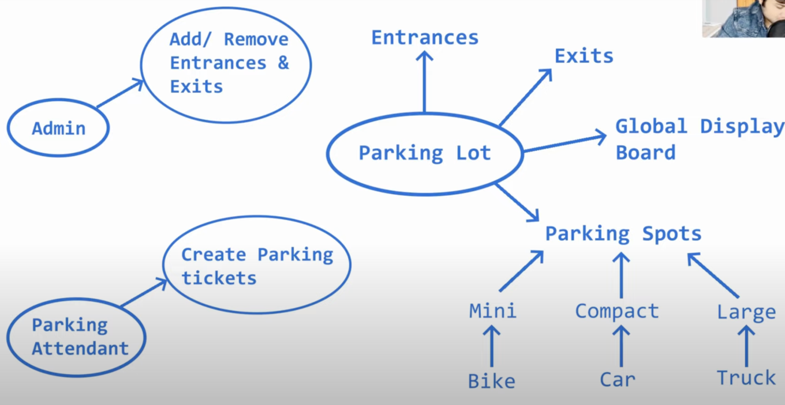
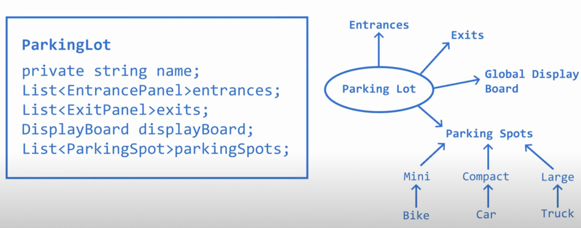
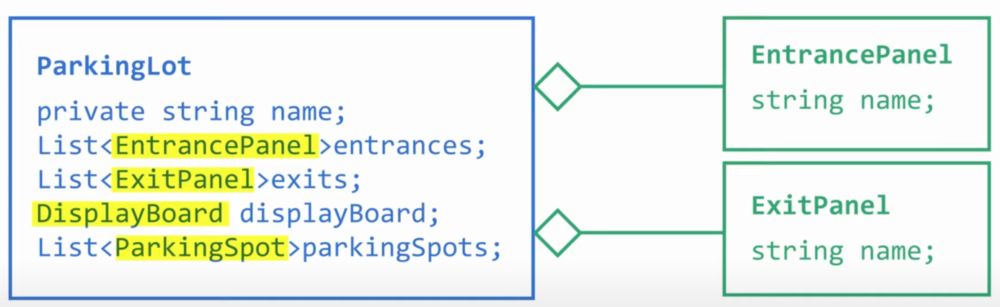
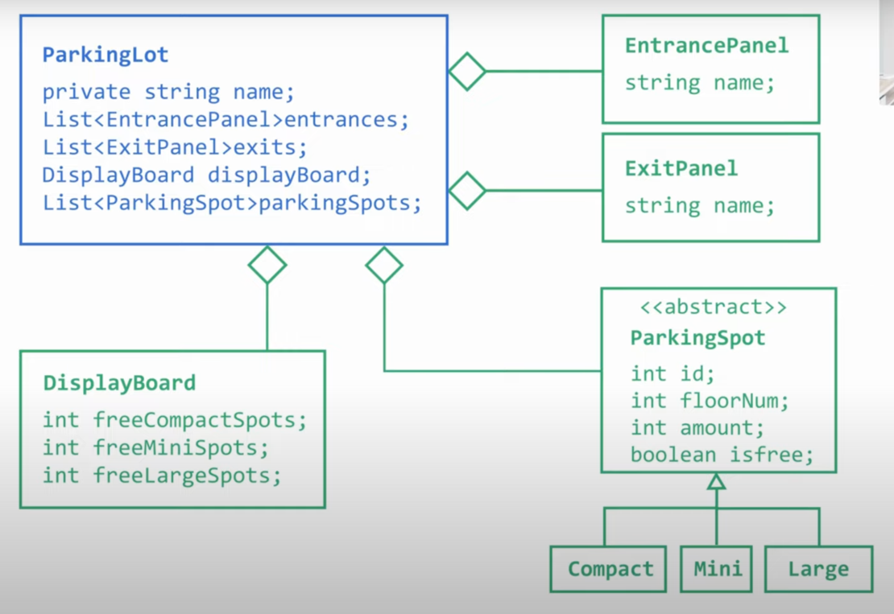
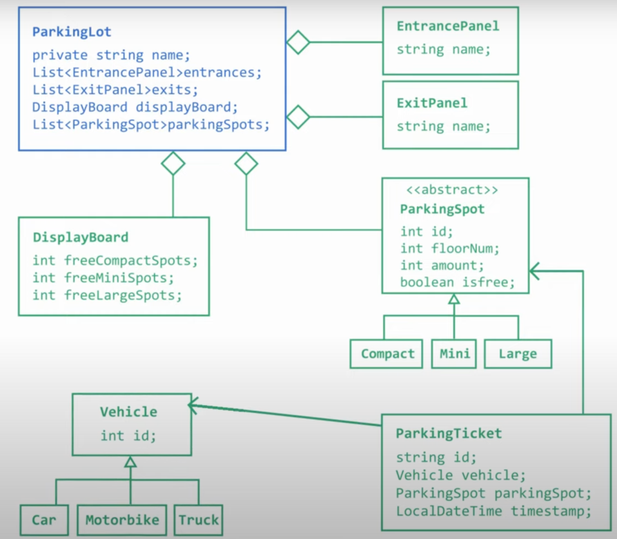
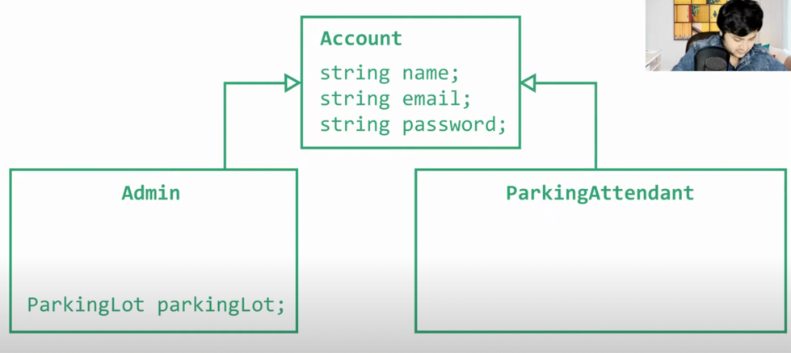

## Problem Statement
Design a low-level system for a parking lot that satisfies the following requirements:

1. The parking lot should have multiple entrances and exits.
2. A global display board should show the number of free parking spots of all types.
3. The parking lot should have different types of parking spots (mini, compact, and large) that allow   parking for motorbikes, cars, and trucks, respectively.
4. The parking lot should have multiple floors.
5. The admin should be able to add and remove entrances and exits.
6. The parking attendant should be able to create parking tickets.
7. The parking lot should support different parking strategies like nearest first or farthest first on the basis of floor number and id of the parking spot.
8. The parking lot should support different means of payment.

Please provide a detailed low-level design for the parking lot system that can handle the above requirements. You should consider how the parking lot will handle incoming and outgoing vehicles, track parking spots, generate and process parking tickets, and manage payments. Additionally, you should consider how the system will communicate with the display board and handle different parking strategies.

### Parking Lot Class Diagram
1. Composition relation exists between them

2. Parking Spot will be an abstract class 

3. Vehicle will be there as well as an abstract class.
4. Parking Ticket
   -Which vehicle is this parking ticket for?
   -For which Parking Spot ( 4th floor 3rd spot? or smthin )
   -At what time was this parking ticket alloted

5. Admin has instance of parking lot and parking attendant can issue parking ticket

6. 