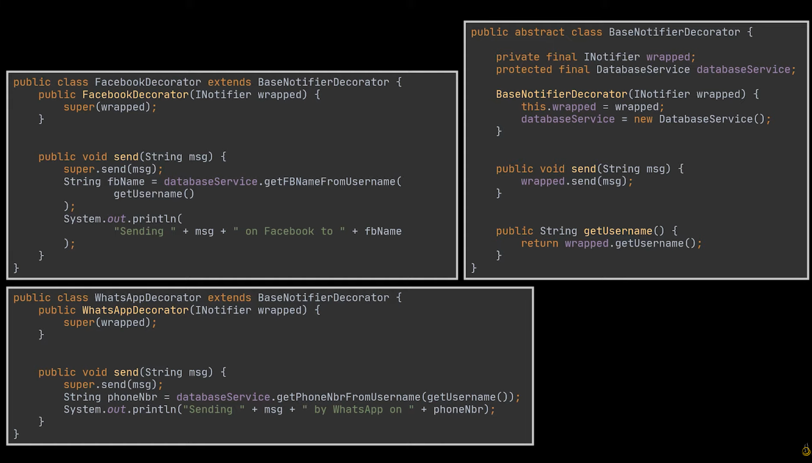
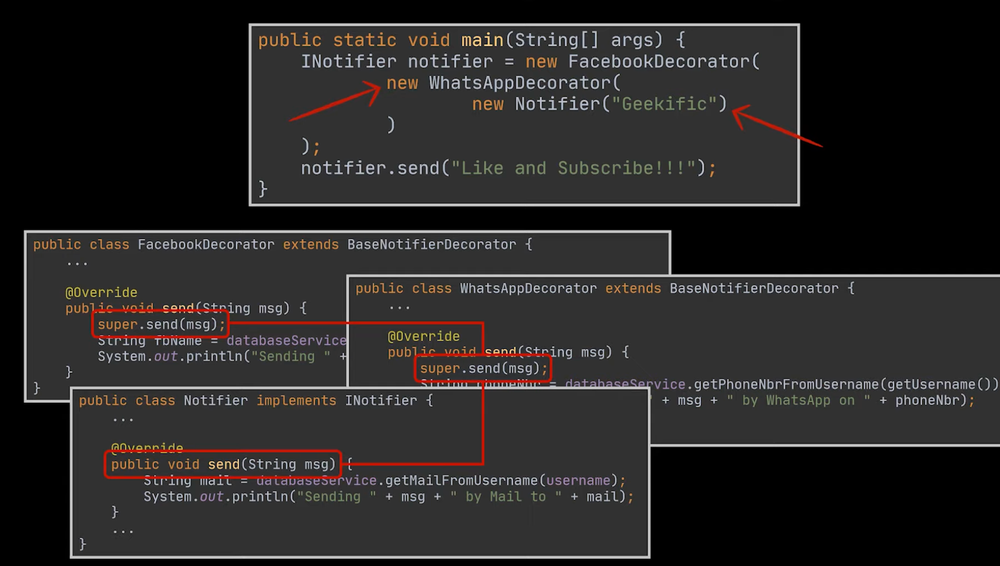

## Decorator Design Pattern

Dynamically wrap additional functionality around existing objects without modifying their core structure.
- allows you to wrap objects in layers of functionality, creating flexible and extensible systems
- use decorators to wrap base objects, adding new behaviours while preserving the original object's interface.


### Traditional 
```Java
public class Notifier {
    private final String username;
    protected final DatabaseService databaseService;

    public Notifier(String username) {
        this.username = username;
        databaseService = new DatabaseService();
    }

    public void send(String msg) {
        String mail = databaseService.getMailFromUsername(username);
        System.out.println("Sending " + msg + " by Mail to " + mail);
    }

    public String getUsername() {
        return username;
    }
}

public class DatabaseService {
    public String getMailFromUsername(String username) {
        return username + "@Mail";
    }
}

```

WHat if the user wants to receive notifications via whatsapp or facebook notification?
Solution is Inheritance wallah 😊

```Java
public class WhatsAppNotifier extends Notifier {
    public WhatsAppNotifier(String username) {
        super(username);
    }

    @Override
    public void send(String msg) {
        String phoneNbr = databaseService.getPhoneNbrFromUsername(getUsername());
        System.out.println("Sending " + msg + " by WhatsApp on " + phoneNbr);
    }
}

public class FacebookNotifier extends Notifier {
    public FacebookNotifier(String username) {
        super(username);
    }

    @Override
    public void send(String msg) {
        String fbName = databaseService.getFBNameFromUsername(getUsername());
        System.out.println("Sending " + msg + " on Facebook to " + fbName);
    }
}

public class DatabaseService {
    ...
    public String getPhoneNbrFromUsername(String username) {
        return username + "@Phone";
    }

    public String getFBNameFromUsername(String username) {
        return username + "@Facebook";
    }
}
```

client will instantiate the desired notifier class and notify the customer\
- NOw customer comes and asks why can't he notified via whatsapp and facebook at same time
- This inheritance approach will lead to a lots of classes like WhatsappaAndFacebook notifier etc.


* Decorator comes into the picture
- lets you attach new behaviors to an object by placing this object inside a special wrapper that contains these behaviors
- Notifier class will remain the same





INotifier <Interface> declares the common behaviors for both wrappers and wrapped objects
Notifier <ConcreteComponent> , wrappped class that defines the basic behavior, which can be altered by the decorators
BaseDecorator < BaseNotifierDecorator > references the wrapped object via the interface so it can refer both the concrete component and its decorators
concerete decorators override the methods of base decorator, but still make use of it either before or after their own execution 


