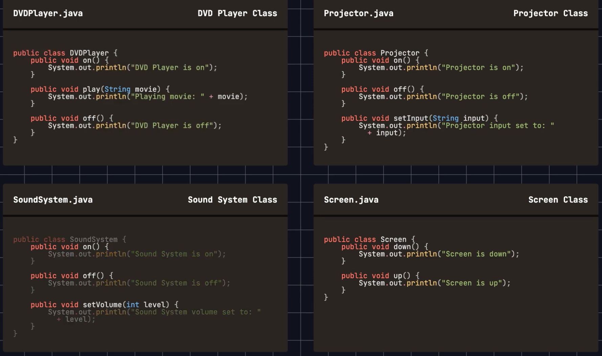
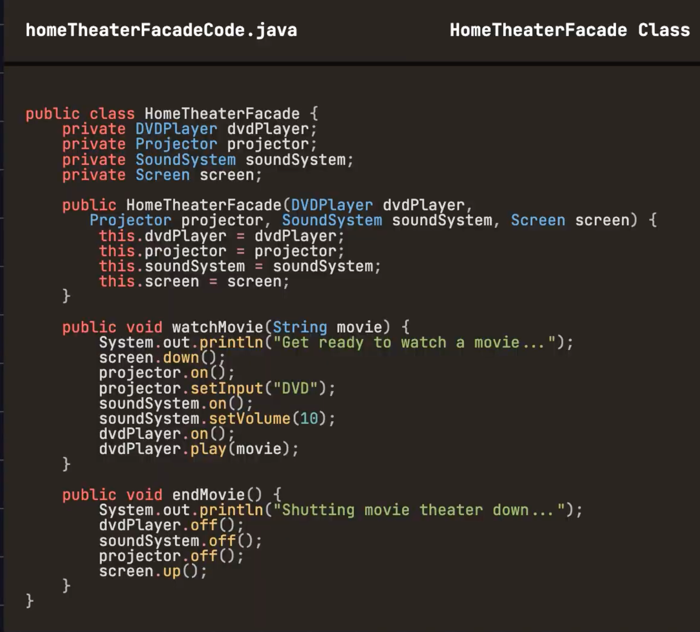

The facade pattern provides a unified interface to a set og interfaces in a subsystem.
The facade defines a higher level interface that makes the subsystem easier to use.

hometheater  facade class that encapsulates all these subsytems
simplifies user operations