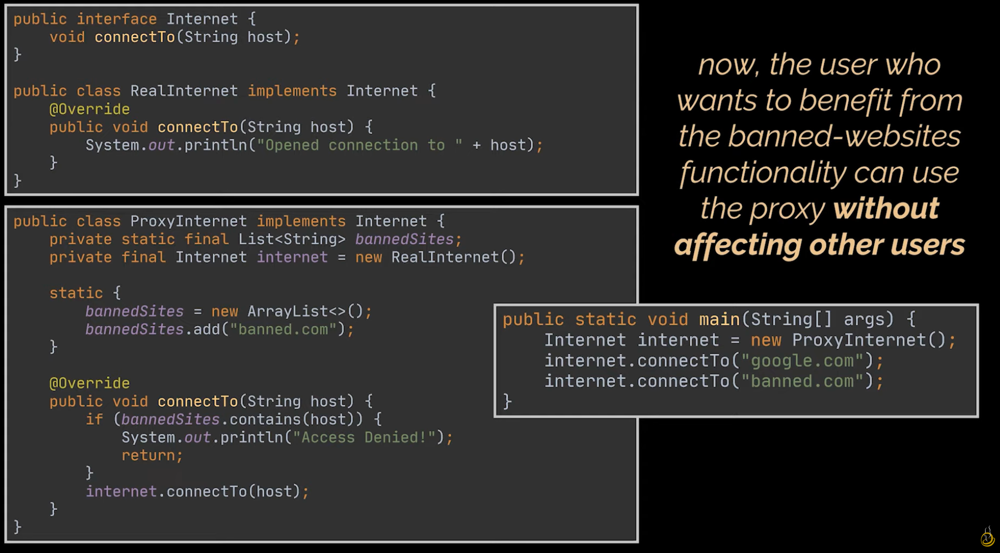
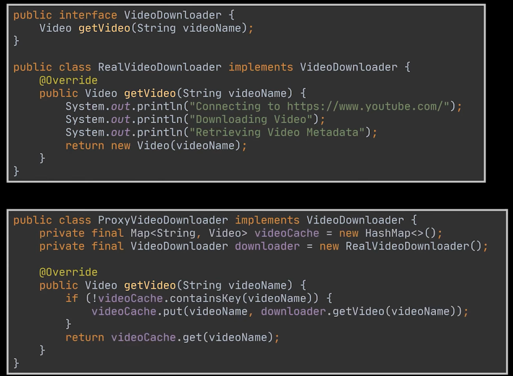

## Proxy Design Pattern

 

Subject (Interface) – common interface for both RealObject and Proxy.
RealSubject (Real Object) – the actual object that does the real work.
Proxy – controls access to RealSubject; can add extra logic like logging, caching, or security.
Client – interacts with the Subject interface (doesn’t know if it’s talking to Proxy or RealSubject).

