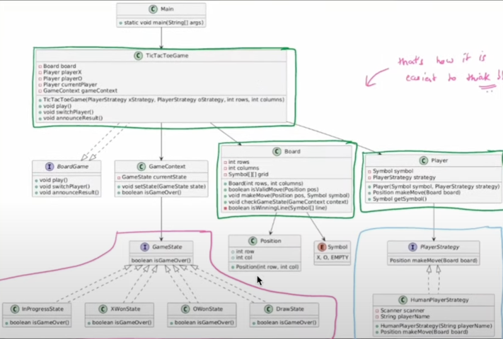

## Objects

1. Piece - X, O, ^  { Extensible code we need }
2. Board - 3x3 { Extensible for n x n }
3. Players - related to a symbol

### Key Components
1. Piece ( Represents 'X' and 'O')
   - Class : Symbol (Represents Game pieces as well as an empty cell)
2. Board ( where the game is played )
   - Class : Board (represents the game board including methods for validating moves, and checking game state)
3. Player (player in the game, stores the player's symbol and contains logic for making moves)

### Design Challanges
Managing Game state -> Move validation -> tracking player turns -> detect game ending conditions

### Patterns?
1. Strategy pattern for player interactions
2. State Pattern for game flow management
3. observer pattern for game event tracking
4. factory for player creation

## Implementation
